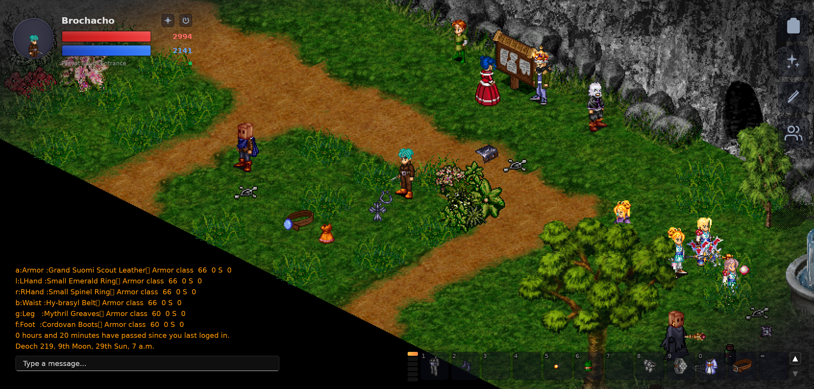

# talgonite

Talgonite is a modern [Darkages](https://www.darkages.com) client. It fixes quality of life issues, removes limitations around UI scaling, more hotkeys, built in private server switching and much more. Give it a go!

> [!IMPORTANT]
> This client is in early development. Expect bugs and missing features.

## Credits

Thanks to [Chaos](https://github.com/Sichii/Chaos-Server) and [dalib](https://github.com/eriscorp/dalib). Their projects were a fantastic reference for how the original client's networking and file formats work.
